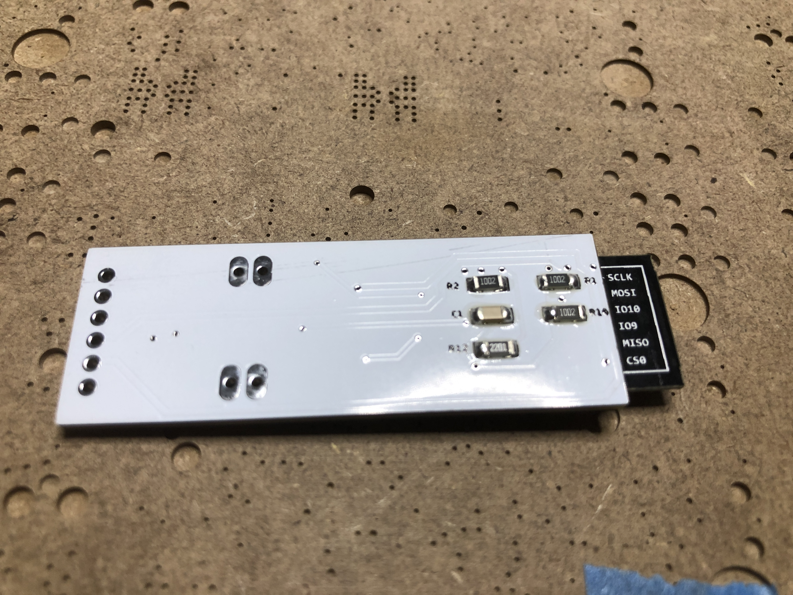
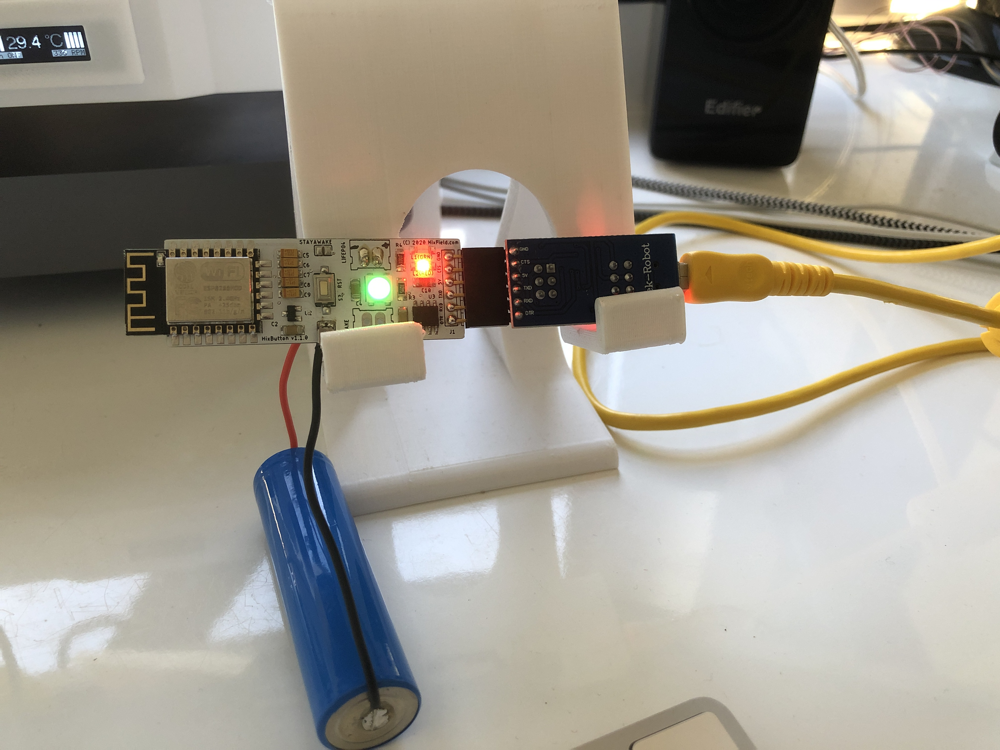
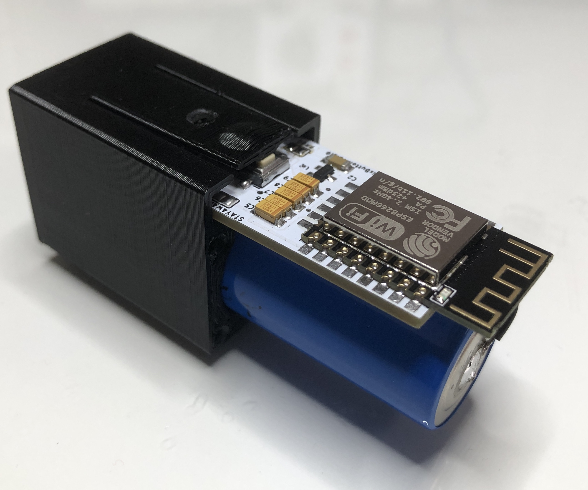
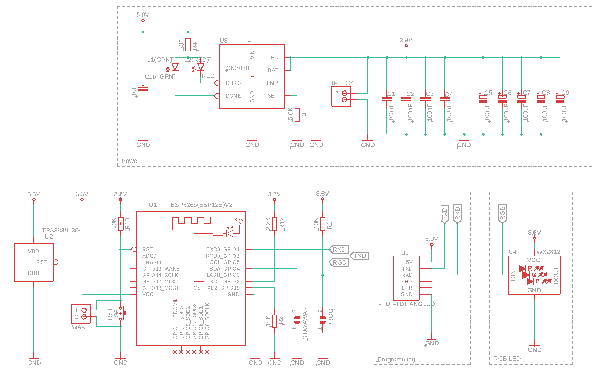
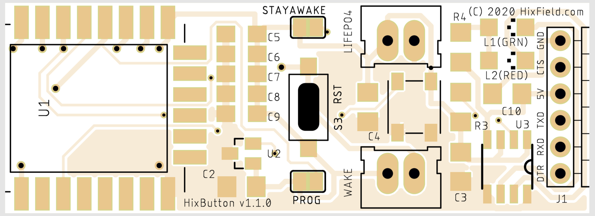

# Get an impression :-)
|  |  |  |
|---|---|---|
|solder paste applied|after headgun: soldered!|and bottom too|
|    |  |  |
|it works!|also ordered solder stencel|stencel and pcb|
|    |  |  |
|Case ESP side|Case header side|Fuly assembled|
# 3D printed case
You can find all requird `stl`files on [thingiverse](https://www.thingiverse.com/thing:4697256) (and in the `case` folder of this repo)

# Schematic

# PCB
| Top                                 | Bottom                                 |
|-------------------------------------|----------------------------------------|
|  |  |

# BOM
|Qty|Value     |Device                 |Parts             |
|---|----------|-----------------------|------------------|
|4  |100nF     |SMD 1206               |C1, C2, C3, C4    |
|5  |100μF     |Tantalum SMD 1206      |C5, C6, C7, C8, C9|
|4  |10K       |SMD 1206               |R1, R2, R10, R11  |
|1  |1uF       |SMD 1206               |C10               |
|1  |2.2K      |SMD 1206               |R12               |
|1  |330       |SMD 1206               |R4                |
|1  |5.6K      |SMD 1206               |R3                |
|1  |CN3058E   |CN3058E                |U3                |
|1  |ESP12E    |ESP12E                 |U1                |
|1  |FTDI      |6P Female header       |J1                |
|1  |GRN       |LED 1206 Green         |L1(GRN)           |
|1  |RED       |LED 1206 Red           |L2(RED)           |
|1  |RST       |PUSHBTNSMALL           |S3                |
|1  |TPS3839L30|TPS3839L30             |U2                |
|1  |WS2812    |LED RGB WS2812 SMD 5050|U4                |

