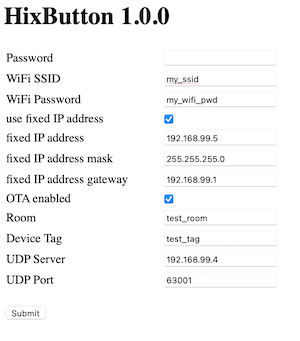

# HixCO2TemperatureIRBlaster - Firmware

![Build with PlatformIO](https://img.shields.io/badge/build%20with-PlatformIO-orange?logo=data%3Aimage%2Fsvg%2Bxml%3Bbase64%2CPHN2ZyB3aWR0aD0iMjUwMCIgaGVpZ2h0PSIyNTAwIiB2aWV3Qm94PSIwIDAgMjU2IDI1NiIgeG1sbnM9Imh0dHA6Ly93d3cudzMub3JnLzIwMDAvc3ZnIiBwcmVzZXJ2ZUFzcGVjdFJhdGlvPSJ4TWlkWU1pZCI+PHBhdGggZD0iTTEyOCAwQzkzLjgxIDAgNjEuNjY2IDEzLjMxNCAzNy40OSAzNy40OSAxMy4zMTQgNjEuNjY2IDAgOTMuODEgMCAxMjhjMCAzNC4xOSAxMy4zMTQgNjYuMzM0IDM3LjQ5IDkwLjUxQzYxLjY2NiAyNDIuNjg2IDkzLjgxIDI1NiAxMjggMjU2YzM0LjE5IDAgNjYuMzM0LTEzLjMxNCA5MC41MS0zNy40OUMyNDIuNjg2IDE5NC4zMzQgMjU2IDE2Mi4xOSAyNTYgMTI4YzAtMzQuMTktMTMuMzE0LTY2LjMzNC0zNy40OS05MC41MUMxOTQuMzM0IDEzLjMxNCAxNjIuMTkgMCAxMjggMCIgZmlsbD0iI0ZGN0YwMCIvPjxwYXRoIGQ9Ik0yNDkuMzg2IDEyOGMwIDY3LjA0LTU0LjM0NyAxMjEuMzg2LTEyMS4zODYgMTIxLjM4NkM2MC45NiAyNDkuMzg2IDYuNjEzIDE5NS4wNCA2LjYxMyAxMjggNi42MTMgNjAuOTYgNjAuOTYgNi42MTQgMTI4IDYuNjE0YzY3LjA0IDAgMTIxLjM4NiA1NC4zNDYgMTIxLjM4NiAxMjEuMzg2IiBmaWxsPSIjRkZGIi8+PHBhdGggZD0iTTE2MC44NjkgNzQuMDYybDUuMTQ1LTE4LjUzN2M1LjI2NC0uNDcgOS4zOTItNC44ODYgOS4zOTItMTAuMjczIDAtNS43LTQuNjItMTAuMzItMTAuMzItMTAuMzJzLTEwLjMyIDQuNjItMTAuMzIgMTAuMzJjMCAzLjc1NSAyLjAxMyA3LjAzIDUuMDEgOC44MzdsLTUuMDUgMTguMTk1Yy0xNC40MzctMy42Ny0yNi42MjUtMy4zOS0yNi42MjUtMy4zOWwtMi4yNTggMS4wMXYxNDAuODcybDIuMjU4Ljc1M2MxMy42MTQgMCA3My4xNzctNDEuMTMzIDczLjMyMy04NS4yNyAwLTMxLjYyNC0yMS4wMjMtNDUuODI1LTQwLjU1NS01Mi4xOTd6TTE0Ni41MyAxNjQuOGMtMTEuNjE3LTE4LjU1Ny02LjcwNi02MS43NTEgMjMuNjQzLTY3LjkyNSA4LjMyLTEuMzMzIDE4LjUwOSA0LjEzNCAyMS41MSAxNi4yNzkgNy41ODIgMjUuNzY2LTM3LjAxNSA2MS44NDUtNDUuMTUzIDUxLjY0NnptMTguMjE2LTM5Ljc1MmE5LjM5OSA5LjM5OSAwIDAgMC05LjM5OSA5LjM5OSA5LjM5OSA5LjM5OSAwIDAgMCA5LjQgOS4zOTkgOS4zOTkgOS4zOTkgMCAwIDAgOS4zOTgtOS40IDkuMzk5IDkuMzk5IDAgMCAwLTkuMzk5LTkuMzk4em0yLjgxIDguNjcyYTIuMzc0IDIuMzc0IDAgMSAxIDAtNC43NDkgMi4zNzQgMi4zNzQgMCAwIDEgMCA0Ljc0OXoiIGZpbGw9IiNFNTcyMDAiLz48cGF0aCBkPSJNMTAxLjM3MSA3Mi43MDlsLTUuMDIzLTE4LjkwMWMyLjg3NC0xLjgzMiA0Ljc4Ni01LjA0IDQuNzg2LTguNzAxIDAtNS43LTQuNjItMTAuMzItMTAuMzItMTAuMzItNS42OTkgMC0xMC4zMTkgNC42Mi0xMC4zMTkgMTAuMzIgMCA1LjY4MiA0LjU5MiAxMC4yODkgMTAuMjY3IDEwLjMxN0w5NS44IDc0LjM3OGMtMTkuNjA5IDYuNTEtNDAuODg1IDIwLjc0Mi00MC44ODUgNTEuODguNDM2IDQ1LjAxIDU5LjU3MiA4NS4yNjcgNzMuMTg2IDg1LjI2N1Y2OC44OTJzLTEyLjI1Mi0uMDYyLTI2LjcyOSAzLjgxN3ptMTAuMzk1IDkyLjA5Yy04LjEzOCAxMC4yLTUyLjczNS0yNS44OC00NS4xNTQtNTEuNjQ1IDMuMDAyLTEyLjE0NSAxMy4xOS0xNy42MTIgMjEuNTExLTE2LjI4IDMwLjM1IDYuMTc1IDM1LjI2IDQ5LjM2OSAyMy42NDMgNjcuOTI2em0tMTguODItMzkuNDZhOS4zOTkgOS4zOTkgMCAwIDAtOS4zOTkgOS4zOTggOS4zOTkgOS4zOTkgMCAwIDAgOS40IDkuNCA5LjM5OSA5LjM5OSAwIDAgMCA5LjM5OC05LjQgOS4zOTkgOS4zOTkgMCAwIDAtOS4zOTktOS4zOTl6bS0yLjgxIDguNjcxYTIuMzc0IDIuMzc0IDAgMSAxIDAtNC43NDggMi4zNzQgMi4zNzQgMCAwIDEgMCA0Ljc0OHoiIGZpbGw9IiNGRjdGMDAiLz48L3N2Zz4=)


## What does the firmware do?
* when the button is pressed the device is reset
* the different hardware components are configured quickly (serial baut rate, RGB led...)
* the configuration is loaded (from EEPROM). This contains the WIFI settings.
* the voltage of the battery is measured and based on that the RGB led is set to GREEN - ORANGE - RED (so the user sees if it needs to be recharged)
* the device now tries to connect to the WIFI
* if the WIFI connection does not work, the RGB led turns white and the device is put in AP mode (see WIFI setup & configuration)
* if WIFI is connected a UDP datagram is send to the configuration server (refer to Datagram contents)
* if the device solder jumper "STAY AWAKE" is not closed, the device is put into deepsleep. This should be used for debuggin only (drains battery)!

## How to flash the device

### Step 0: software confirmation
* make sure you have PlatformIO correctly setup in your Microsoft Visual Studio Code
* open the software folder in Microsoft Visual Studio Code
* configure your default settings in the secret.cpp file

### Step 1: initial upload via serial cable
* make sure your USB/FTDI is set to **3.3V**
* insert your USB to FTDI on the PCB
* there is a solder jumper "prog", using a screwdriver close it and then press the button (= reset button) while still keeping the solder jumper closed.
* you can now let go of the screwdriver, the device should now be in programming mode
* open the platformio.ini and configure the upload port and speed to use your USB/FTDI for example:
	- `upload_speed = 460800`
	- `upload_port = /dev/cu.usbserial-A50285BI`
* upload to the device
* press the button and the device should boot, but it will take much longer then usual because the SPIFFS is not yet flashed

### Step 2: upload the SPIFFS filesystem
* the SPIFFS filesystem is used to store files required for the configuration web interface (only activated if the device cannot connect to the WIFI)
* put the device in programming mode again (refer to procedure above)
* in platformIO select "Upload Filesystem image"
* press the button, the device will reboot


### Step3 : see boot information
* connect using 115200 baut
* if you open the serial monitor the device outputs a lot of info

## WIFI setup and configuration
### force stay awake
* if you want to configure the device, and prevent it from going to sleep when pressing the button, close the solder jumper `STAYAWAKE` then the configuration interface will always be active. The RGB LED will turn magenta to indicate the jumper is closed. **You have to remove this solder jumper after config because this will drain the battery very quickly!**. 
* the device has mDNS enabled and will listen for `{room}_hixbutton_{tag}` where `{room}` and `{tag}` are defined in configuration (with defaults configured in `secret.cpp`)

### automatic access point creation
* when you press the button and the device cannot connect using its stored WIFI settings the RGB led will turn white and it will enable an access point (AP)
* after 10 minutes and if nobody is connected to the AP, the device goes to sleep again
* using a computer, tablet, phone... connect to the access point and enter the IP address of the device (192.168.4.1)
* you will now see the web configuration screen that you can use the configure all settings:


## Datagram contents
Datagram is one json document containing the following information:

```
 {
   "device_type":"HixButton",
   "device_version":"1.0.0",
   "device_tag":"test_tag",
   "room":"test_room",
   "wifi_ssid":"GEMIC_2.4Ghz",
   "wifi_rssi":-78,
   "wifi_mac": "E0:98:06:84:9B:F6",
   "vcc":3.42208
}
```
* `device_tag` and `room` are configured (via secret.cpp for defaults or via the config inferface) and identify the device. If you have mulitple devices this is what you use to differentiate between tem
* `wifi_rssi` gives an idea of the WIFI signal strenght
* `vcc` is the voltage level of the battery. You can use this to raise an alarm (if < 2.65v typically) on the server side